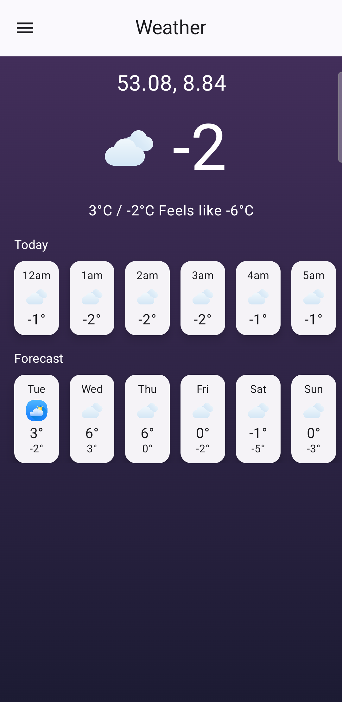

# Weather App

This is a simple weather app that fetches and displays the latest weather data for a user's location from a list of coordinates. The location updates every 10 seconds, and the app loops back to the first location once all coordinates have been cycled through.

## Features

- Displays the current weather for the user's location based on a list of provided coordinates.
- Updates location every 10 seconds, looping back to the first location after reaching the end.
- Weather data is fetched from the Open-meteo API, which provides free access to current weather data.

## Coordinates

The following list of coordinates represents the user’s location timeline:

- 53.619653, 10.079969
- 53.080917, 8.847533
- 52.378385, 9.794862
- 52.496385, 13.444041
- 53.866865, 10.739542
- 54.304540, 10.152741
- 54.797277, 9.491039
- 52.426412, 10.821392
- 53.542788, 8.613462
- 53.141598, 8.242565

## API Integration

The app uses the [Open-meteo.com](https://open-meteo.com) weather API to fetch weather data based on latitude and longitude.

### Example Request
To fetch the weather for a specific location, you can use the following API endpoint:
https://api.open-meteo.com/v1/forecast?latitude={latitude}&longitude={longitude}&current_weather=true

## 📐✏️ Architecture

The app follows the Model-View-ViewModel (MVVM) architecture with a Repository pattern to separate the user interface, logic, and data management.

- **Model**: Represents the data and business logic of the app. It deals with actual data sources like the weather data fetched from the Open-meteo API.
- **View**: Represents the UI of the app. It is built using Jetpack Compose and displays the weather information to the user.
- **ViewModel**: Holds and manages the data required by the View. It exposes data to the UI using `StateFlow`.
- **Repository**: Serves as an intermediary between the ViewModel and data sources. It abstracts data fetching, whether from the Open-meteo API or other sources, allowing the ViewModel to focus on business logic rather than data retrieval details.

### Flow:
1. The user opens the app and sees the weather data for the current location.
2. The app updates the location every 10 seconds, fetching new weather data from the Open-meteo API for each location.
3. The Repository handles fetching data from the API.
4. The ViewModel updates the UI with the weather information for each location.
5. If there is no internet, the app will display an error and gives option to retry.

This architecture ensures scalability and maintainability by decoupling the UI from the data and business logic.

## 🛠 Tech Stack

- **Kotlin**: The app is built using Kotlin, the preferred programming language for Android development.
- **Jetpack**:
    - **Jetpack Compose**: Android’s modern UI toolkit that simplifies and accelerates UI development.
    - **Android KTX**: A set of Kotlin extensions that provide concise, idiomatic Kotlin code for Android.
    - **AndroidX**: A namespace that encompasses the Android Jetpack libraries, improving upon the original Android Support Library.
    - **Lifecycle**: Manages UI-related data in a lifecycle-conscious way, preventing memory leaks and reducing boilerplate code.
    - **ViewModel**: Holds and manages UI-related data in a lifecycle-conscious manner.
- **Dagger Hilt**: A dependency injection library that reduces the boilerplate of manual dependency injection.
- **Kotlin Coroutines**: Simplifies asynchronous programming on Android by managing background tasks in a lightweight and efficient way.
- **Kotlin Flow**: A type that can emit multiple values sequentially, used for handling asynchronous data streams.
- **Retrofit**: A network client for making HTTP requests to the Open-meteo API.
- **OkHttp**: A powerful HTTP client that ensures reliable network requests.
- **GSON**: A JSON parser used for serializing and deserializing weather data.
- **Logging Interceptor**: Logs HTTP request and response data for debugging purposes.

## Screenshots

Below are some screenshots of the Weather App:

## Assumptions

- If the user exits the app or an error occurs, the app will restart from the first coordinate.
- The app will display basic weather information and can be extended to include more details.

## Improvements

- Add offline support to show previously fetched weather data if there is no internet connection.
- Show more detailed weather information (e.g., humidity, wind speed, etc.).
- Allow the user to see weather details for upcoming days.
- Add animations for location transitions.
- Provide options to switch between different units (e.g., Celsius to Fahrenheit, KM/H to m/s).
- Optimize images for different screen densities by converting PNG files to SVG or resizing them.
- Show the current temperature for the rest of the day starting from the current hour.

## Contributing

Feel free to fork the project and submit issues or pull requests.

